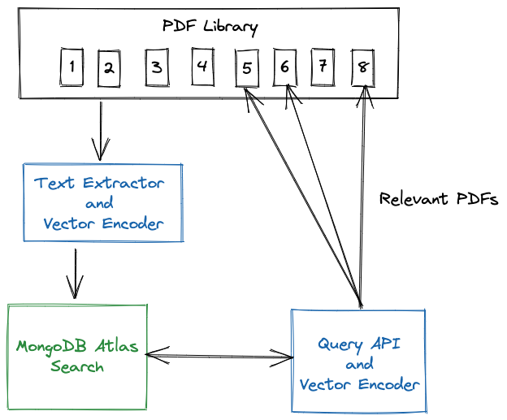

# Atlas Vector Search Across PDFs

## Introduction

This demo is a prototype of how Atlas Vector Search and Atlas Search could be used to find relevant PDF documents.

To begin, the text from the PDFs are extracted, split into sentences, and mapped into a 384 dimensional dense vector space. The PDF sentences along with their vectors are stored into MongoDB Atlas.

An Atlas Vector Search index then allows the PDFs to be queried, finding the PDFs that are relevant to the query. The demo uses both Atlas Vector Search and Atlas Search to perform semantic search and lexical search on the same content, allowing the user to compare results.



## Setup

### PDFs to Query

For this demo, the text extractor reads the PDFs from a local directory. To get started, I've supplied 5 MongoDB whitepapers, but please try with your own PDFs.

### Atlas

Open [params.py](params.py) and configure your connection to Atlas, along with the name of the database and collection you'd like to store your text.

### Extract and Encode the PDFs

Install the requirements. This implementation uses:

- [PyPDF2](https://github.com/py-pdf/PyPDF2) Python library for text extraction
- Hugging Face [sentence-transformers/all-MiniLM-L6-v2](https://huggingface.co/sentence-transformers/all-MiniLM-L6-v2) pretrained model for the dense vector mapping
- [pymongo](https://pypi.org/project/pymongo/) - the Python driver for MongoDB
- [flask](https://flask.palletsprojects.com/en/3.0.x/) - Flask is a micro web framework for Python that is widely used for building web applications and APIs.

```zsh
pip install -r requirements.txt
```

Run the [extract_and_encode_pdf.py](extract_and_encode_pdf.py)

```python
python3 extract_and_encode.py
```

The script will look for PDF files in the `PDFs` directory.

Sentences and metadata is stored in MongoDB Atlas in the following document structure:

```json
{
  "pdf": "CustomerFAQ.pdf",
  "page": 0,
  "sentence": "Can I edit my Click and Collect date?",
  "sentenceVector": [
    -0.07247348874807358,
    -0.0065712337382137775, ...],
  "type": "customerService"
}

```

The `type` field is used in the UI to display different icons next to the answer.

### Create Search Index

[Create a Search index in Atlas](https://www.mongodb.com/docs/atlas/atlas-search/create-index/)  
Create a search index on the collection:

```json
{
  "mappings": {
    "dynamic": false,
    "fields": {
      "sentence": {
        "type": "string"
      }
    }
  }
}
```

### Create Vector Search Index

[Create a vector search index](https://www.mongodb.com/docs/atlas/atlas-vector-search/vector-search-type/)  
Create a vector search index on the collection:

```json
{
  "fields": [
    {
      "numDimensions": 384,
      "path": "sentenceVector",
      "similarity": "euclidean",
      "type": "vector"
    }
  ]
}
```

### UI

To run the UI launch

```bash
python3 app.py
```

For the links to work, make sure you place your PDF files in the `static/pdfs` folder.

## Demo

You are now ready to search your vast PDF library for the PDFs that may hold the answers to your questions.

Your query will be mapped using the same sentence transformer that was used to encode the data and then submitted to Atlas Search.
